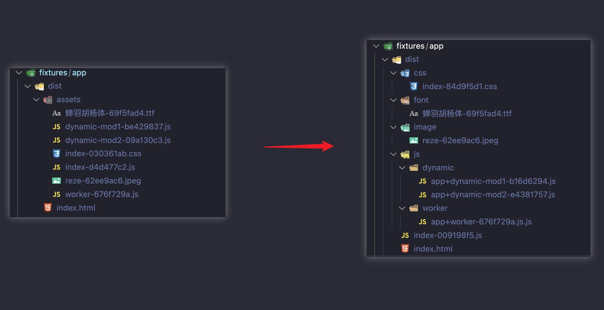

# vite-plugin-semantic-chunks

[](https://npmjs.com/package/vite-plugin-semantic-chunks) [](https://npmjs.com/package/vite-plugin-semantic-chunks) [](https://github.com/tjx666/vite-plugin-semantic-chunks/actions/workflows/unit-test.yml)

generate semantic chunks



## Installation

```bash
npm i -D vite-plugin-semantic-chunks
```

## Usage

```ts
// vite.config.ts
import vitePluginSemanticChunks from 'vite-plugin-semantic-chunks';

export default defineConfig({
  plugins: [vitePluginSemanticChunks()],
});
```

## License

[MIT](./LICENSE) License © 2023-PRESENT [YuTengjing](https://github.com/tjx666)
